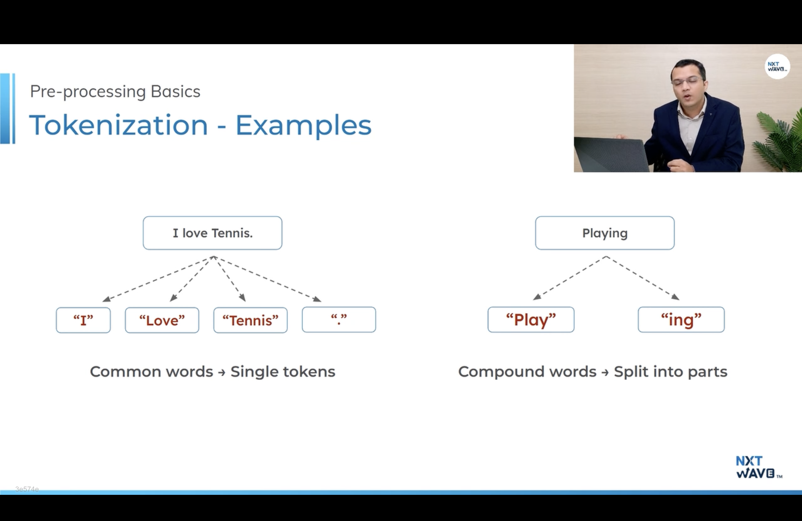
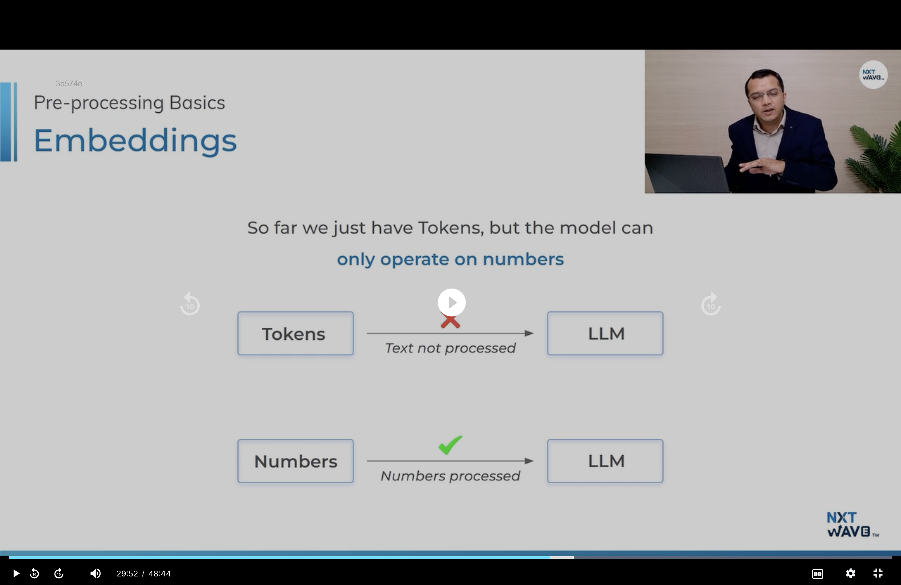
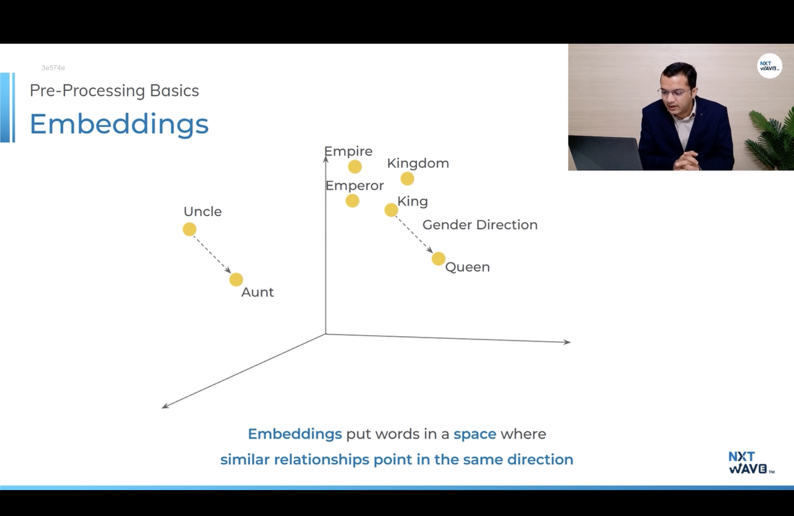
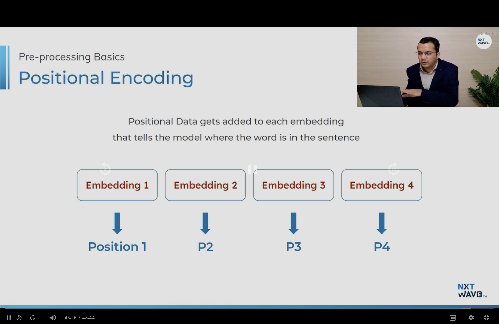
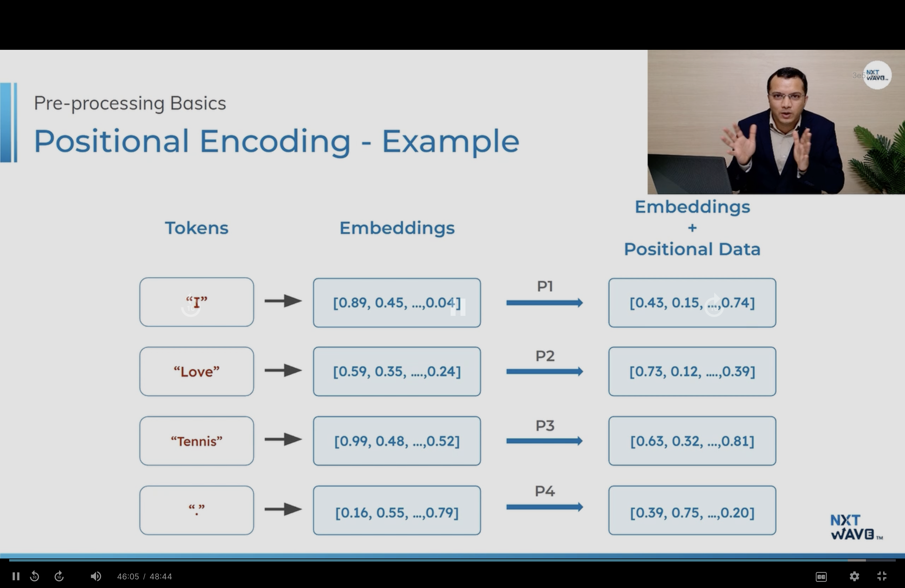
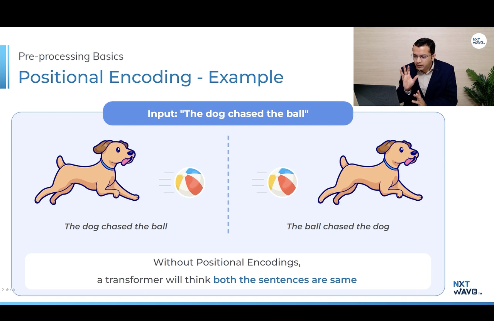

# Setting Up the Environment
    !pip install -U google-genai

# Simple Code
    from google import genai
    from google.colab import userdata

    api_key = userdata.get("GEMINI_API_KEY")

    client = genai.Client(api_key=api_key)

    def studyAssistant (user_prompt):
        response = client.model.generate_content(
            model="gemini-3.1-flash",
            contents=user_prompt
        )

        return response 

    user_question = "I want to know what is Redux in React js. And why it is using?"
    output = studyAssistant(user_question)
    print(output)

# Adding Personalities through System Prompts
    inside the generate_content add config after the model
    import types from google.genai
    config = types.GenerateContentCofig(
        system_instruction = system_prompt
    )

# Import EVN inside python:
    import os   
    from dotenv import load_dotenv

    load_dotenv()

    os.getenv(API_KEY)

# Controlling Generation Settings
 - Temperature and Max token 
 - Temperature - Temperature controls the randomness of the model's output. Increasing the temperature value increases the randomness of the output. For Gemini, the range is typically from 0 to 2.
 - Max Token - Tokens are the chunks of text the model processes (e.g., words, parts of words). We can set max_output_tokens to control the length of the response.
 - Inside the config add the temperature and maxtoken.

 <mark>max_output_tokens=50 to 2000+ based on the usage</mark>

# Building UI For ChartBot:
 -UI Building framework (e.g: Gradio, streamlit)
 - Gradio:
    !pip install -q gradio  
    - Gradio is the open source python library it help to bulid the UI creatively 
    - Different input types: Text boxes, sliders, dropdowns, chat windows, and even image or webcam inputs.
    - Multiple output types: Text, images, audio, plots.

    import gradio as gr

    Interface - Gradio provide a special class called Interface to quickly create a demo for your python function.
    fn: The Python function that Gradio should run when the user interacts with the UI.
    inputs: Defines how to take input for your function (e.g., gr.Textbox, gr.Radio).
    outputs: Defines how to display the output from your function.
    title: The title of your application, displayed at the top of the UI.
    description: A short description shown below the title.

    Inputs: gr.Textbox, gr.Radio, gr.Dropdown, gr.Image, gr.Slider, etc.
    Outputs: gr.Textbox, gr.Image, gr.JSON, gr.Audio, gr.Plot, etc.

    demo = gr.InterFace(
        fn = study_assistant,
        inputs = [
            gr.Textbox(lines=4, placeholder="Ask a question", lable="Question"),
            gr.Radio(choices=list(personalities.keys()), value="friendly", label="Personality")
        ],
        output = gr.Textbox(lines=10, lable="Response")
        title="Our title"
        description="Enter our app description"
    )

    demo.lauch(debug=True)

# Deploying in hugging face space:

    At the top use %%writefile app.py in py file
    import os 
    os.getenv("ENTER API KEY ID")

    this three change have to update in code

 -Requirement:
   - requirements.txt file add the used library for hugging face
   - Use %%writefile requirements.txt
   - write the library 
 Download the app.py file and requirements.txt file

## Go to hugging face:
 - Login 
 - click the profile icon and click new space
 - In license Use MIT
 - In Setting add secret value add api key

 URL of the app = https://huggingface.co/spaces/your_username/user_space_name

 ## Limitation
  - Limited RAM and Storage 
  - Slow down with high traffic 
  - app sleep after 48 hours of inactivity 
  - limited storage
  - can't store massive files 

29/09/26

# What is LLM
 - It is an advanced Type of AI Model that is trained on vast amount of text data to process, understand and generate human lauguage. 

# Inferencing:
  - It means Predicting the next word 

# How LLMs Work:
  - We Will predict the next word but identify the next pattern. LLMs do exactly this, but on a MUCH LARGER SCALE - They've seen billions of sentences and understood billions of patterns
    Patterns + Next-word prediction 

    LLM Predict Word by word like below:
        
        A Quick brown fox jumps -> LLM -> predict -> over
        A Quick brown fox jumps over -> LLM -> predict -> the 
        A Quick brown fox jumps over the -> LLM -> predict -> lazy
        A Quick brown fox jumps over the lazy ....

    <mark>Based on the temperture this prediction will me differ.</mark>

# Netural Network:
  - Netural network having the structure similar to our brain.
  - Just by using the big netural network get the intelligent behaviour. You have to arrange the small small neutral network in a order that order is called as a architecture

# Architecture:
    - RNN - Recurrent Neural Networks
    - LSTM - Long Short-Term Memory
    - Transformer - the transformer architecture became a revolutionary breakthrough in the domain of generative AI 

# Transformer:
  - Most of the LLMs are using this Transformer Architecture to understand the input and generate the output

  - <mark> The Transformer Architecture was first introduced in this paper by google in 2017.</mark>

### RNN and LSTM:
  - Earlier Google transilate used this Architeture 
  - In a Email if you compose it will suggest the next word write it is also RNN and LSTM
  - ### Problem in RNN and LSTM:
    - One Word at a time process like reading a sentences
    - You can't read word 50 until it process 1-49 are processed
    - ### Memory Fading:
        While in a sentence it will process the only 49 at the time after that use the new sentence like response to use
        
        EX:
          - The movie that my friend told me to watch last week, Which had the funny superhero aliens, it was actually...
          -> By this time it reaches "it was actually...", old models forgot what "it" referred to  
  - ### How transformer solve this problem:
    - Transformer look at the ENTIRE sentence at once, not word-by-word

    - IN RNN The -> Movie -> I -> Watched -> Yesterday.

    -> In transformer view, the whole sequence.
      - [The, movie, i, watched, yesterday, was, amazing] 

# Transformer Architeture:
    Encoders for input
    Decoders for output
  - LLMs understand only number so we have to do some pre-processing steps.

# Pre-processing:
  - Tokenization -> Before the model can process the input, it will first split the word into smaller parts, called tokens
    - tokens can be in entire word, parts of word (subwords) and even single character (like ? , . !)
    - LLMs make this as a smaller chanks 
  - Embedding 
  - Positional encoding 

  # dictionary:
    - In dictionary we have all meaning of the word 
    - Same as in llm we have the huge dictionary it give the token id for each word and character
    - Different Model has different dictionary and token ids.

# Token:

# Tokenizarion Visualizer:
    https://platform.openai.com/tokenizer
# Embedding:

  # Vector:
    - text -> token1 -> Embedding [0.43, 0.85, ..., 0.51]
    - These vector represents the token in numeric form, and that numeric representation is called and Embedding 
    - List of number is called vector.
    - One token many contain 512 or 768 or higher. Model to Model it will differ.
    
    EX:
     king ->  [0.95, 0.86, ... 0.56]
     met ->  [0.45, 0.56, ... 0.55]
     his -> [0.35,0.33, 0.80 ...., 0.18]

     1 to -1 the range will be differ based on the model 

     These numbers capture the meaning of a token. 

  - This allow the model to understand relationship between words in this above image king and queen have the relationship right.

# Embedding Visualizer:
    https://projector.tensorflow.org

  - Select the Word2Vec ALL 

# Positional Encoding:

Encoders:
  - Encoder is responsible for reading and processing these embeddings.
  - It helps in understanding the meaning and the intent behind the input.

Decoders:
  - Decoder uses the encoder's understanding to decide what token should be generated next. 